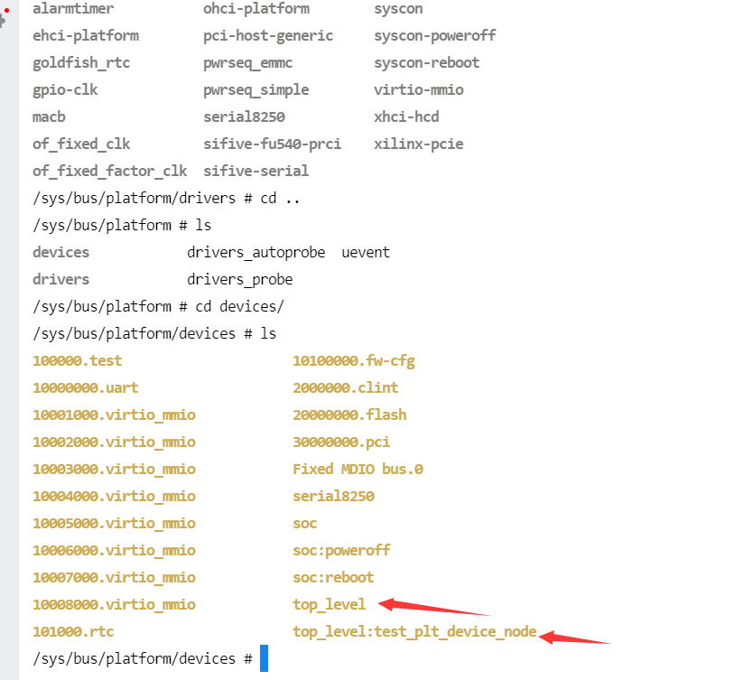
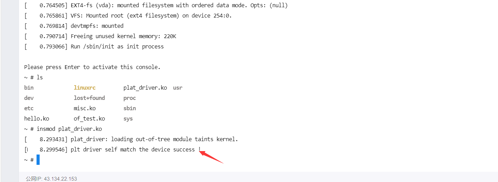
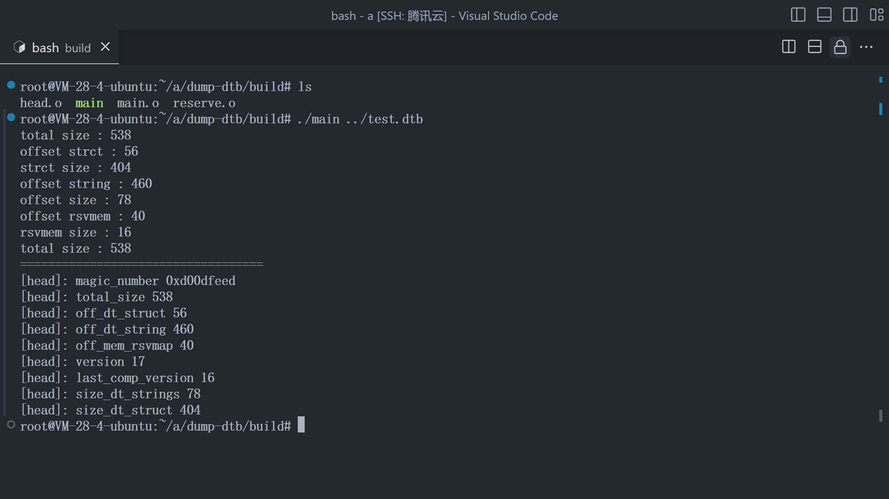
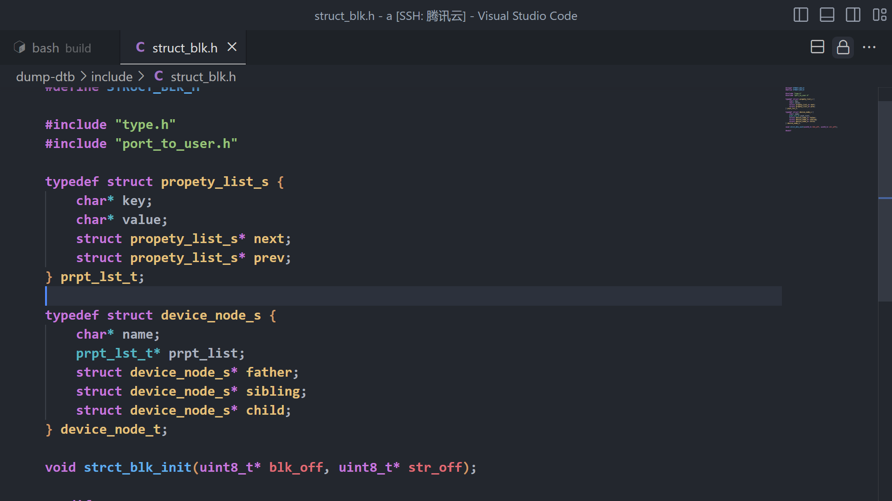

# 设备树

### 前言

- 笔者最近在学习 AMP 多核异构部署，入门 Linux 内核相关的知识，关于资源配置，分配需要使用 设备树相关的知识，所以本着学习的原则，系统性的学习了一下设备树的语法，以及相关的知识。

### 前情需要

- 没有写过Linux 内核驱动或者了解过内核驱动，没有硬件相关的知识【硬件知识的话一些基本的架构相关知识就好，笔者自己硬件知识也不够，主要还是有软件框架意识】的UU 可以先对这部分先行了解，不会在这里有过多的说明。
- 笔者全程会以 RISCV-Linux 5.10 的版本来做讲解，牵涉到的内容包括 设备树语法， 设备树相关的编译工具， 设备树的二进制形式，内核中关于设备树的API， 启动的时候如何解析等。
- [前情环境，qemu kernel gdb 环境搭建](https://bbs.scumaker.org/t/topic/460/2)

### 实践内容

- 在本篇章中，你将会**学习使用设备树语法**，将qemu 内部的设备树 dump 出来后，**添加自己的设备节点**，成功被内核识别，同时添加对应**节点的hello world 驱动**
- 在本篇章中，你会使用**C 语言**开发一个**小型DUMP工具**，用于DUMP **DTB的具体内容**，牵涉到的一些技术： **文件IO流， 递归算法，设备树的格式**等等。
- 【这本来是碎碎念里面的东西，但是我觉得有必要放到前面来说】，其实语法这种东西，更建议看**入门讲解的视频**，然后懂了一点基础语法后，再去**查阅官方文档**，这个文档的关键在于**一个实践的方法或者思路**，可以作为你学习设备树语法后**想要实践的入门实践**。

### Let'sssss do it 

### 一些磨磨唧唧的介绍

- **什么是设备树？device tree**
  - **DTS ： ** device tree source，可以类比为编译语言，理解成为C， JAVA ， PYTHON 的源码之类的东西，用来描述一个硬件的具体设备信息，同时也正如其名字一样，是一棵树，那自然就有各个节点，节点有自己的属性，也可以有子节点。
  - **DTB ：**device tree binary ，可以类比为被编译后的二进制文件，如被 GCC 编译后的二进制文件，具体的格式也是后续我们开发DUMP工具会研究的。
  - **DTC ：** device tree compiler ，类比GCC，编译DTS代码的

### 设备树语法， DTS文件语法

- **节点表示**

  - [标签] : <节点名字> 

  - ```c
    cpu_1 : cpu@1 {
    	...
        ...
        device_type = "cpu";
    };
    
    cpu@2 {
      ...
      ...
    };
    ```

  - 如上例子所示，标签不一定需要，节点名字是一定需要的 ，节点内部是描述节点的属性

  - **标签 ： 节点的别名**

  - 节点名字 ：本来是可以随意命名的，只要是满足命名要求 ：只包含大小写字母，一些特殊字符【建议网上搜一下】，只能以字母开头

    -  一般的命名格式【 硬件名@地址】

- **节点属性**

  - 标准化属性
    - 解释
      - 官方标定的有意义的属性 ，理解为C里面的标识符，类似 "int"这类有意义的属性
    - 语法
      -  key - value 
    - 【请查阅官方文档】
  - 自定义属性
    - 解释
      - 自己命名的一些属性，可以在内核驱动中利用API获得
    - 【请查阅官方文档】

- **其他**

  - 【请查阅官方文档】

### DTB二进制格式

- **DTB分区**
- DTB的每个字段以大端形式存放
- 所有的基础单元都是4个字节 ，简单认为以4字节，大端格式进行解析，除了字符串块
  - 信息块
    - 用于指定 其他各个块的起始偏移地址 和 大小
    - 指定DTB 版本号和兼容的版本号
    - 识别的魔术字
    - DTB文件大小i
  - 预留空间块
    - 保留内存的地址
    - 保留内存的大小
    - 两个固定类型 U64
    - 预留空间块固定大小 16字节
  - 结构块
    - 存放每个节点的信息的部分
      - 节点的属性以及对应的值
      - 子节点信息等等
  - 字符串块
    - 节点中属性名字的字符串的集合
    - 每个字符串以 '\0' 作为字符串的结尾标志
- **分区图片**
  - 

### 实践

-  **写一个 DTS 使用 DTC进行编译**

  - DTS代码

  - ```c
    /dts-v1/;
    / {       
        #address-cells = <2>;
        #size-cells = <2>;
        aliases {
            cpu0 = "/cpus/cpu@0";
            cpu1 = "/cpus/cpu@1";
            cpu2 = "/cpus/cpu@2";
            uart0 = "/soc/uart@20000000";
        };
        
        chosen {
            bootargs = "test boot args";
        };
    
        cpus {
            #address-cells = <1>;
            #size-cells = <0>;
            cpu@0 {
                phandle = <0xc0>;
                model = "cpu,id:0";
                status = "okay";
                reg = <0>;
                device_type = "cpu";
                compatible = "riscv","test","sifive";
            };
            cpu@1 {
                phandle = <0xc1>;
                model = "cpu,id:1";
                status = "disabled";
                reg = <1>;
                device_type = "cpu";
                compatible = "riscv","test2";
            };
            cpu@2 {
                phandle = <0xc2>;
                model = "cpu,id:2";
                status = "fail";
                reg = <2>;
                device_type = "cpu";
                compatible = "riscv","test3";
            };
        };
    
        soc {
            #address-cells = <2>;
            #size-cells = <1>;
            compatible = "simple-bus";
            plic@40000000 {
                phandle = <0x23>;
                model = "plic description";
                compatible = "plic";
                reg = <0x00 0x40000000 0x100>;
                interrupt-controller;
                #interrupt-cells = <1>;
                #address-cells = <2>;
            };
            uart@20000000 {
                model = "uart description";
                compatible = "uart";
                interrupt-parent = <0x23>;
                interrupts = <0x3>;
                reg = <0x00 0x20000000 0x50>;
            };
            node_c {
                model = "node_c";
                node_cc {
                    model = "node_cc";
                    node_ccc {
                        model = "node_ccc";
                    };
                };
            };
        };
    
    };
    ```

  - 编译代码 【提前把DTC下好】

  - ```
    dtc -I dts -O dtb xxx.dts[源文件路径] -o test.dtb
    ```

- **DUMP出QEMU里面的DTB 然后修改DTB，加载自己的节点 和对应的驱动**

  1. ```c
     qemu-system-riscv64 -M virt,dumpdtb=qemu-dump.dtb -smp 1 -m 256M -nographic -kernel Image -drive file=rootfs.img,format=raw,id=hd0  -device virtio-blk-device,drive=hd0 -append "root=/dev/vda rw console=ttyS0"
     ```

  2. 这里为什么参数一定是这个 参考[前情环境，qemu kernel gdb 环境搭建](https://bbs.scumaker.org/t/topic/460/2)，我们需要保持和运行一致的参数

  3. ```
     dtc -I dtb -O dts qemu-dump.dtb -o qemu-dump.dts
     ```

  4. ```
     mv qemu-dump.dts qemu-dump.dtsi
     ```

  5. 在同一个目录下创建 qemu-load.dts文件

  6. 文件内容

  7. ```c
     /include/"dump.dtsi"
     / {
             top_level {
                     #address-cells = <1>;
                     #size-cells = <1>;
                     compatible = "isa";  //保证test_plt_device_node能被识别成为一个platform_device
                     test_plt_device_node {
                             compatible = "my_test_plt_device";
                             model = "test_plt_device_node";
                             status = "okay";
     
                     };
             };
     };
     ```

  8. 运行

  9. 

  10. 驱动代码

  11. ```c
      #include <linux/module.h>
      #include <linux/kernel.h>
      #include <linux/platform_device.h>
      #include <linux/of.h>
      
      static int plt_probe(struct platform_device* device)
      {
              printk("plt driver self match the device success !\n");
              return 0;
      }
      static int plt_remove(struct platform_device* device)
      {
              return 0;
      }
      
      static struct of_device_id drv_src_ids[] = {
              {.compatible = "my_test_plt_device"},
              {},
      };
      static struct platform_driver my_plt_driver = {
              .probe =plt_probe ,
              .remove =plt_remove,
              .driver = {
                  .name = "plt_self_driver", 
                  .owner = THIS_MODULE,
                  .of_match_table = drv_src_ids,
              },
      
      };
      
      module_platform_driver(my_plt_driver);
      
      MODULE_LICENSE("GPL");
      MODULE_AUTHOR("JERRY");
      MODULE_DESCRIPTION("test plt driver and of");
      ```
      
  12. 加载之后

  13. 

- **小型 DUMP 工具**

  - 
  - 笔者解析了一下头部，然后初步建模了一下 结构信息块【为什么没解析核心结构信息块的原因是： 笔者本来想就写个百来行的小代码解析，但是发现解析着解析着，还要牵涉到一些链表操作【解析属性的时候，属性是挂在节点下的一个链表的】（但是笔者又没有事先去扒个链表相关的库下来，又不想写太多重复代码，没什么意思），又想到多半没有人会看这篇博客，索性不写了，反正都是递归解析属性那一套，以前写过类似的东西】
  - 
  - 如果你想知道后续的内容，直接联系笔者，笔者QQ ：3229960773 谢谢！
  - [代码链接](https://gitee.com/Jer6y/dev_tree_parser/tree/master/dump-dtb)


